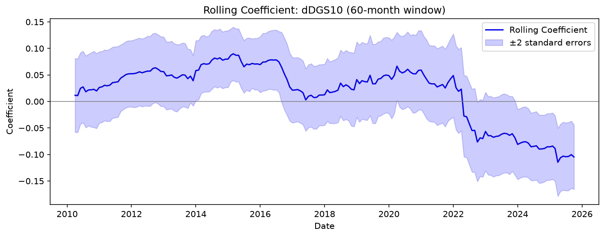

# Macroeconomic Sensitivity of Technology Equities

Rolling-regression analysis of how the relationship between macroeconomic conditions 
and Nasdaq-100 returns has changed over 20 years.

## Key finding

A full-sample regression finds no relationship between 10-year Treasury yield changes
and Nasdaq-100 returns (beta = +0.005, p = 0.843, R² = 0.017). That result is
misleading. The relationship exists, but it reversed sign partway through the sample
and the two regimes cancel out when averaged.



| Period | Rate sensitivity |
|---|---|
| 2005-04 to 2015-06 | **+0.043**  |
| 2015-07 to 2025-10 | **-0.0423** |
| Full sample | +0.005 (p = 0.843) |

Rolling regression over 187 overlapping 60-month windows traces the full transition:
sensitivity runs from **+0.07 (2014, t = 2.9)** to **-0.10 (2024, t = -3.4)**, crossing
zero during 2022. Rolling R² ranges from 0.021 to 0.211, meaning macro conditions
explained ten times more variation in some periods than others.

The economic interpretation is that the sign depends on what drives yields higher.
Before 2022, rising yields largely reflected improving growth expectations, which is
not bad news for growth equities. After the 2022 inflation shock, rising yields
reflected monetary tightening, and the discount-rate effect dominated.

## Method

1. **Data alignment.** Daily equity prices, daily Treasury yields, and quarterly GDP
   consolidated into a single monthly panel (247 months, 2005-04 to 2025-10).
2. **Look-ahead correction.** GDP is lagged one quarter, since FRED indexes it at the
   start of a quarter but the BEA publishes it roughly a month after the quarter ends.
3. **Baseline OLS** with HAC (Newey-West) standard errors, plus a broad-market control
   (SPY and QQQ minus SPY) to test whether tech equities are distinctively sensitive.
4. **Rolling regression**, 60-month window, with ±2 standard error bands.
5. **Out-of-sample walk-forward validation** with lagged predictors.

## Out-of-sample result

The model does not predict. Across 186 one-step-ahead forecasts it underperforms a
trailing-mean benchmark on both metrics:

| | Model | Benchmark |
|---|---|---|
| RMSE | 0.0521 | 0.0501 |
| Directional accuracy | 0.575 | 0.640 |
| Out-of-sample R² | **-0.078** | |


**This project is an explanatory framework for how macro sensitivity changes over time,
not a forecasting tool.**

## Data

| Series | Source | Frequency |
|---|---|---|
| QQQ, SPY (adjusted close) | Yahoo Finance via `yfinance` | Daily |
| DGS10 (10-year Treasury yield) | FRED | Daily |
| GDPC1 (real GDP) | FRED | Quarterly |

## Running it

```bash
pip install -r requirements.txt
jupyter notebook Macro.ipynb
